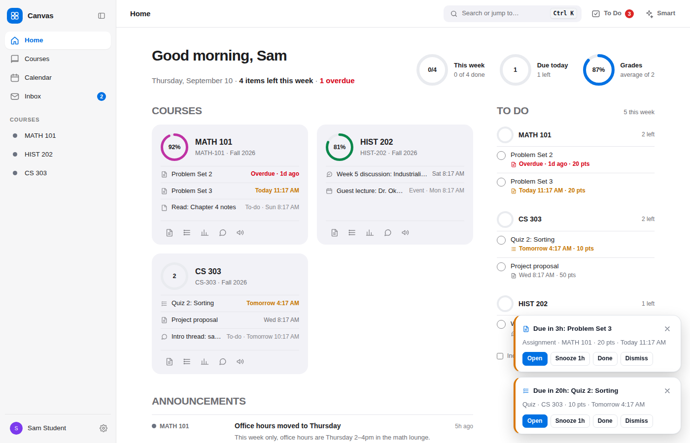
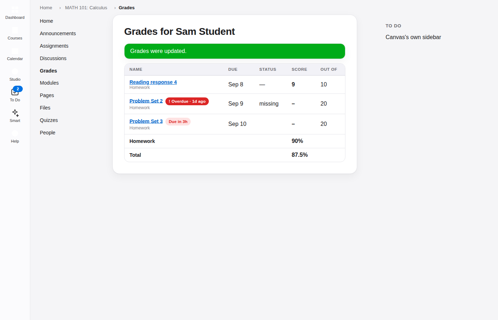
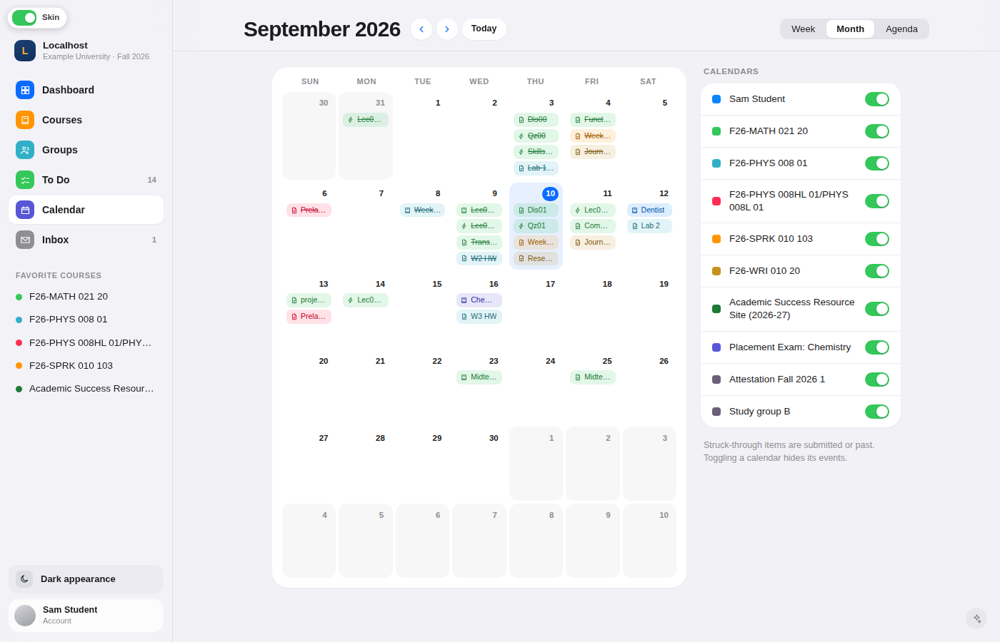
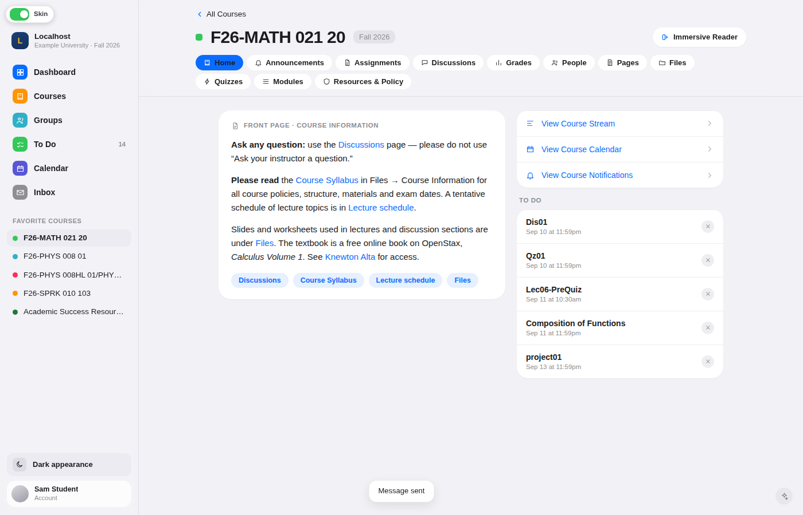
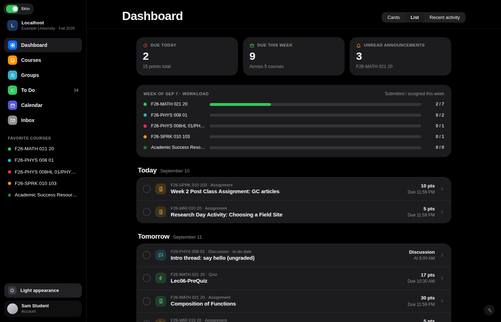
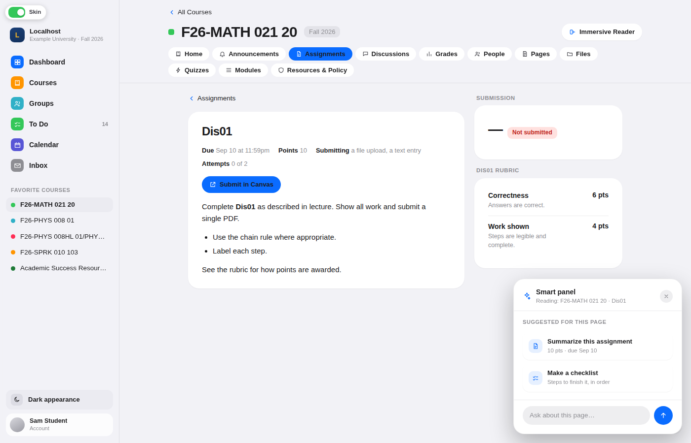

# Simpl Courses

**Canvas, quietly rebuilt.** A Safari extension (shipped as a Mac app) and a Chrome extension giving **Canvas** a new interface, drawn to a single design: rounded cards on a soft grey ground, one sidebar, segmented controls, an iOS-style dark appearance, and a discreet **smart panel** that reads the page you are on using your own Claude or ChatGPT key.

Nothing is decorated; every screen is redrawn from the Canvas API with your own data, on top of the real Canvas page for that URL. The look is switched off and on from the toolbar popup or the settings, and turning it off always reveals exactly the page you were on.

| Dashboard (list view) | Course grades with nested rings |
| --- | --- |
|  |  |

| Calendar (month) | Course home |
| --- | --- |
|  |  |

| Dark appearance | Smart panel on an assignment |
| --- | --- |
|  |  |

(Taken against the bundled mock Canvas, so the course content is fake.)

## What you get

**Guided setup** – runs over your own Canvas page. Installing opens a short page that says how to start (Safari and Chrome): open your Canvas, press the toolbar button, press **Set up**. Until then the toolbar popup is nothing but that button; pressing it asks for the site (that host alone gets permission, from the click) and opens the setup as a glass card over the page you are on, one question per step. Your courses, read from your enrolments with a skeleton bound to the real request — nothing is ticked to start with, whatever Canvas already has starred, and unchecked courses stay hidden everywhere (they become your Canvas favourites, the one list every screen follows); grades (daily local snapshots on or off, a GPA goal starting at 4.00, a target letter per course starting at A+, and no question about your past record, which stays optional); the smart panel — optional, but the answer is not: a key that checks out, or *Not now*, with Continue dead while the field is empty — with the steps to get a Claude or ChatGPT key, a check before the key is saved (Gemini is shown as coming soon) and a notice in red that it is for learning, not for completing assignments or quizzes; and where those courses should sit — listed down the sidebar, or in a panel that opens when you hover on **Courses**; then *Finish* closes the card and the tour starts on the same page. Skip closes it and never starts the tour. On iOS the same card opens on the first launch.

**Never a broken card** – a screen that throws, that would land nothing but an error, or that has not drawn after fifteen seconds gives way to Canvas's own page for that URL, with a note saying so, rather than a card that says something failed. **Nothing cached** – every page load asks Canvas afresh and draws once from its answer; within a page each request is made once and shared, and nothing is kept between pages.

**Account panel** – the profile row at the bottom of the sidebar (and the avatar on a phone) opens a panel: the appearance switch, Simpl Courses settings, the guided setup and the tour, your Canvas profile, *All Canvas settings* (Canvas's own settings page) and notification preferences, and **Log out**, which submits Canvas's own logout form (the app's sign-out on iOS).

**More from Canvas** – whatever your school added to Canvas's own left-hand nav is read from the page and kept under the sidebar's navigation (and under the avatar on a phone): account-level tools such as *My Materials* or Studio open Canvas's page for them with the shell kept over it; *History* opens Canvas's recently-visited list as a sheet; *Help* lists the school's help links.

**Sidebar** – your school's own mark from Canvas's theme, whole inside a small rounded tile with the site name beside it (its app icon, favicon or header logo; Canvas's default assets never count, and Settings can point at another image), then Dashboard / Courses / Groups / To Do (with a count) / Calendar / Inbox (with unread count) / Grades, your favourite courses with their Canvas colours, a Dark/Light appearance switch and your account. The courses can live somewhere else instead: **On hover** (the last step of the setup, and Settings → Appearance) takes them off the sidebar and opens them in a panel beside the **Courses** row — the same list in the same order, with *All courses* under it. It answers the keyboard as well as the pointer: the arrow keys open it and move down it, Escape shuts it.

**Dashboard** – six counters (due today with points, due this week across N courses, unread announcements, overdue, graded this week, classes today), a per-course workload bar for the week (submitted ÷ assigned; courses with nothing assigned fold away under a disclosure), and the same three views Canvas has: **Cards** (with a submitted-items progress bar, quick links and a "2 due today" badge), **List** (by day, with a circle to mark items done) and **Recent activity**. The view you pick is saved to your Canvas profile, as Canvas does.

**Courses** – your dashboard courses as cards with term, role, progress and what is due next; every other course grouped by term (groups can be reordered with the arrows, and the order is remembered) with a star to add it to your dashboard; All / Past / Future and search.

The six counters at the top of the dashboard, in a fixed 2×3 grid, each open a sheet listing exactly the items they counted, with points, times and the course, so a number is never a dead end: due today, due this week, unread announcements, overdue (past due with nothing in, plus late work still without a score, from Canvas's own missing and late flags), graded this week (by the day the grade was posted, with points earned over points possible; excused work counts but stays out of the ratio) and classes today (calendar events on the selected courses' calendars, never assignments). A counter whose data cannot be read is dropped rather than shown as 0, and every count follows the course selection.

**To Do** – everything from today through the next seven days, by date, by priority or by course. It knows what is *actually* due: assignments, quizzes and graded discussions carry a due date; pages, events and ungraded discussions with only a to-do date are labelled as such. Tick an item to mark it done in your Canvas planner (and untick it later); dismiss hides it without touching the work; a switch shows completed and dismissed items so they can be restored. **Add your own task** (office hours, an email to send, reading that is not an assignment) creates a Canvas planner note – due today, this week or on a date you pick – so it follows you to every device; your tasks sit in a *My tasks* group, count toward the list but never toward the course count, and are the only rows with a delete button. A task of your own stays on the list until you tick it off or delete it, whatever its date – one from last week or one for next month is still there – while course work keeps to the seven-day window. Every row, Canvas work included, has a **priority** chip (High / Medium / Low / None) for triage; priority is yours alone, kept on this device by the item's id, never sent to Canvas, and *By priority* buckets the list by it, skipping empty buckets. Your preferences for a site (priorities, views, goals) are one shared record: a change made in one tab is merged with, never written over by, a change made in another.

**Calendar** – Week, Month and Agenda views over your Canvas calendars, an agenda **range picker** (tap a start and an end day), and struck-through text for submitted or past items. Your favourite courses are the calendars shown by default (the same course list every screen follows); your personal calendar, courses you have not starred and your groups sit under **Other calendars**, off until you turn one on (Canvas's ten-calendar limit is enforced with a message). Canvas refuses a whole calendar request when one course is off-limits, so a refused calendar is retried alone, marked "Not shared" and the rest still load; if the calendar API fails altogether, the planner's items fill in with a note saying so.

**Notifications** – one page (sidebar, and the bell on Today on a phone) for everything that needs attention, drawn from what Canvas already reports and grouped by kind: **Overdue** and **Due soon** from the planner (due items with nothing submitted: the last 14 days, the next 48 hours), **Graded** and **Feedback** from submissions in the activity stream (a score, an instructor comment), **Announcements** from the unread ones, and **System** for Canvas's own notification messages plus the day's local grade snapshot. Chips filter by kind, *Unread only* narrows the list, each row opens the item in Canvas with an action that says what to do (Submit now, Start quiz, See grades, Read comment), and *Mark all read*, *Clear* and *Restore* keep the list tidy. Read and dismissed states are kept locally, because Canvas has no API to mark a stream item read; the sidebar badge counts what is neither.

**Inbox** – conversations with course and scope filters, a reader with reply, and compose with recipient search. Stars, read state and sending all go through the Canvas API.

**Groups** – current and previous groups, each with its own screen: activity, announcements, discussions, pages, people and files.

**Grades** – one page for the whole term. It follows the courses you chose in setup (your Canvas favourites; every current course until you star one). A **term GPA** card turns each of those courses' Canvas score into a letter and its 4.0 points (A 4.0, A− 3.7 … the usual 93/90/87 cut-offs) and averages them with every course counting equally; underneath, the range your GPA lands in if all ungraded work comes in ten points lower, and how far you are from your goal. Canvas stores no GPA and no history, so **tracking** is opt-in: enter the GPA you had before this term and how many courses it covers, and the page shows a *cumulative* figure and saves one snapshot a day from then on (nothing is back-filled), drawing a **trend** line against a dashed goal line once it has two. Three stat cards: **Momentum** (this snapshot against the previous one), **On-time submissions** (submitted before the due time, from the `late` flag on your submissions) and **Grade mix** (a chip per course letter, highest and lowest named). Then **one card per course**: a ring with the score, the letter and its points, and a bar with your target marked on it. Hovering the ring alone opens it into one thin ring per assignment group with a mini breakdown, so five courses can be compared without opening any of them; **Details** opens the course's own grade page in a sheet (nested rings, per-group percent and weight, the 100%-weight strip with dashed segments for groups that have nothing graded yet, the assignment list) and holds the −/+ **target grade**: the card says what percentage of the still-unscored points you need to reach it, when it is already secured and when it is out of reach, using the same group weights as the course's own grade card. The eye button **hides** a course from the overview and the GPA maths (an audit, a P/NP course); it waits in a tray marked *not counted in GPA* until you show it again, and the header always says "N courses · M with grades so far". A course Canvas has not scored shows **N/A**, contributes nothing and gets no target. The gear opens the GPA settings sheet (goal in 0.05 steps, the tracking switch and its two inputs); *Reset setup* at the bottom forgets the prior record and the snapshots. The GPA is a reading of your Canvas scores, not the figure on your transcript, and the page says so.

**Courses** – a header with the course colour, term and an **Immersive Reader** button (a clean large-type reading view of the page, shown only on views that have a readable body: the front page, pages, assignment, quiz and announcement descriptions, the syllabus), a course rail built from the course's own navigation and grouped as *Course* / *Materials* / *People* / *Campus tools* (external tools become plain links), with counts for unread announcements and grades posted this week, the active item in the course colour, and a Collapse control that shrinks it to tiles. Then:
- **Home** – the front page (or modules / syllabus / assignments / stream, whichever the instructor chose) with link chips, plus course links and the course To Do.
- **Announcements**, **Assignments** (by date or by type, with status badges), **Discussions** (unread and reply counts), **People** (roles, sections, pronouns), **Pages**, **Files** (folders, and a **file viewer**: a file – from Files, a module or a link to it – opens in a sheet over the page rather than in a new tab, with its details, a preview where one can be drawn (images, video, audio and text here; PDFs and documents through Canvas's own preview), and Download and Open in Canvas beside it), **Quizzes**, **Modules** (requirements and completion).
- **Grades** – one card that reads the whole grade at a glance: nested rings (the outer ring is your total as Canvas reports it, one inner ring per assignment group that has graded work, 0%-weight groups drawn stippled) with the total beside them; a *By group* legend with points, weight and the items Canvas excludes; groups with nothing graded listed without a ring; and a *How the grade is weighted* bar that shows each weighted group's share, filled once it has a score. Then the assignment list with "not counted" and late badges, and a **what-if mode**: edit any score to see the outcome. Nothing is saved or sent anywhere.
- Item views for assignments (rubric, submission, comments), discussion threads (nested replies, reply box), pages, quizzes and the syllabus.
- **Handing work in** – lives inside the assignment, not on a page of its own: under the instructions, in the same scroll, a **Hand in** block carries the assignment's own rules (due, points, attempt *N of M*, availability window, what it accepts) and then **File upload** / **Text entry** / **Other**; "Submit assignment" at the top (or **Submit** on a To Do row) just brings the block into view, the tab you chose is remembered per assignment, and the block reads the assignment already loaded for the page rather than fetching it again. The drop zone's helper line and the picker's accepted types come from the assignment's `allowed_extensions`, and a file of the wrong type is refused on the spot with the reason instead of after a long upload. Files go through Canvas's own three-step upload with a progress bar per row; the text entry is kept as a draft on this Mac until it is sent; **Other** lists exactly the tools the instructor enabled for handing work in (Box, Office 365, …) plus *Website URL*, and a tool row punches through to the tool's own picker in a sheet, taking the file it hands back into the attachment list. An optional comment goes with the submission. The footer says when late starts; after **Submit assignment** a receipt shows when it landed, what was sent, how long before (or after) the deadline, the attempt and the grade state, with **Resubmit** when attempts remain. Media recordings and annotations stay on Canvas's own page.
- **Taking a quiz** – "Take the quiz" opens an intro card in the course's own column, under the header and beside the rail like any assignment, with the quiz's own rules (time limit, attempts, one-question-at-a-time, no going back, access code). **Begin attempt** is what takes the page: the sidebar, the course header and the rail slide away over half a second and the attempt has the whole window; they slide back when it is over. Then the questions either one at a time or all on one scrolling page, progress pills that jump between questions, flag for review, a timer pill that counts down from the attempt's end time (with warnings at five and one minute), a review screen listing every answer before **Submit quiz**, and a submitted screen with the score when Canvas releases it. Every answer and flag is sent to the Canvas quiz-submission API as you go; nothing is ever submitted for you. Question types Canvas only renders itself (matching, fill-in-the-blanks, file upload…) hand off to Canvas's own quiz page on the same attempt.
- **Attempt limits** – a quiz or assignment can never be handed in more times than it allows. The quiz page shows *attempts N of M used* and, once the last one is spent, a *No attempts left* badge instead of the Take button; the intro card says the same and offers the feedback instead; and the start call itself refuses to open an attempt past the limit (Canvas's own count on the submission plus any extra attempts the instructor granted; unlimited stays unlimited). Assignments work the same way: the submit flow and the Resubmit button go away when the allowed attempts are used.
- **Quiz feedback** – **See feedback** on the receipt, the quiz page or an attempt row opens the finished attempt in the course column (the navigation stays): a score card (points, percent, *N of M correct*, when it was graded) with the instructor's comment, then one card per question with the mark, the points, your answer, the correct answer when the quiz's *show correct answers* window allows it, and the instructor's **worked solution** (the question's own feedback comments, equations as Canvas's images). Each card has an **Explain** / **Why was this wrong?** button that scopes the smart panel to that question with its own suggestions (walk me through it, why my answer was wrong, a similar practice problem, where this was covered); closing the panel brings the page's suggestions back. Quizzes whose results are hidden (`hide_results`) say so and show nothing else; the explanation is a study aid, never a regrade.

Anything without a screen of its own – external tools and their embeds (Box, YuJa…), file previews, profile and settings pages, Canvas's own quiz page – is a **punch-through**: Canvas's page is left exactly where it is in the DOM, so tool launches and embeds keep working, and the new sidebar, header and course rail float over it with a hole that Canvas's content is laid out into (its own right column, such as a quiz's question list and timer, stays beside it). In the dark appearance the hole is darkened with a filter; a **View in light mode** button at the top right of the punch-through area shows the page as Canvas drew it instead (some embeds read better that way), and the choice is remembered per site. While a quiz attempt is open (ours or Canvas's), navigation is hidden and leaving asks for confirmation.

**Motion and loading** – screens rise in and their blocks arrive with them (the Dashboard's cards all on one beat; To Do groups, the Grades hero then its cards and quiz feedback cards on a short stagger, capped so a long list never crawls); a sheet grows out of the control that opened it (a counter, the Details button, the gear) over a scrim that blurs in; popovers pop; cards lift under the pointer and buttons give when pressed. Numbers arrive rather than appear: on entering the Dashboard the three counters run through a few digits for under half a second and land on the real count, the workload bars wipe from the left and the list floats in beneath them; on entering Grades the term and cumulative GPA roll the same way, the trend line strokes itself on, each course ring sweeps to its score down the grid and the group rings fill in as they open – and sweep back out, last in first, when the pointer leaves, the letter fading back in after them. This plays once, on entry – a number you are reading never changes on its own, and the last frame is always the exact value from Canvas. Sidebar and course-rail icons are bare glyphs in their own colour, full strength on the active row. State changes (a ring opening, a bar filling) apply instantly, and transitions are kept for hover and press only. While a page loads, a thin bar sweeps along the top of the window, and skeleton blocks shaped like the content (list rows on the Dashboard, course cards on Grades) hold its place so nothing jumps when the data lands; a page that comes from cache never flashes either. Under *Reduce Motion* the entrances are dropped, every number shows its final value at once, and the loading indicators stay.

**Getting unstuck** – a page that wedges is noticed and mended rather than left: a request that never answers is given up after 20 seconds (asked once more, then failed like any other); a screen whose answer never comes, or an interface that never mounts, gets one fresh load – and if the same page stalls again within the minute it is shown as it is, never reloaded in a loop; the extension being updated under an open page (which cuts its scripts off from storage and the background) is noticed when the page is next looked at and mended with a fresh load; and a sidebar wash lit for a load that never came is cleared. A reload is never made while it would lose work – a quiz attempt, a submission being written, text being typed – a note asks for one instead.

**Loading in the background** – nothing is kept between page loads (every load asks Canvas afresh), but within a page the next press is usually ready before it happens. Once the screen on show has settled and the page is idle, the other screens' first requests are made in the background – the Dashboard, To Do, Calendar, Inbox, Grades, Groups, Courses – and inside a course every tab's; hovering a course tab or a course in the sidebar starts its data as well. A screen never waits for anything but its own first round trip: the Dashboard paints after one, with its unread-announcements counter filling in when that feed lands, and a course's home column is asked for in the same round trip as its rail. Requests go through a gate that keeps at most ten in flight (Canvas refuses a burst past about a dozen) and serves the screen being opened before anything the background asked for; a throttled reply is asked again after a moment rather than shown as an error.

**Smart panel** – the small button at the bottom-right. It reads the current page and suggests actions that fit it: summarize what's due, plan the week, summarize an assignment or make a checklist, draft a discussion reply, condense a page, explain rubric feedback or a grade. Replies stream in; drafts can be copied or inserted into the reply box for you to edit. The word "AI" never appears; it is the smart panel.

## Requirements

- Safari: macOS 13 Ventura or later, Safari 16.4 or later, and Xcode 15 or later (free, from the Mac App Store) to build the Mac app
- Or Chrome / Edge on any platform – see [Chrome (and Edge)](#chrome-and-edge) below; no build needed
- Optional: a [Claude API key](https://console.anthropic.com/settings/keys) and/or a [ChatGPT API key](https://platform.openai.com/api-keys) for the smart panel

## Install (build the Mac app)

Safari extensions ship inside a Mac app, so the app is built with Xcode. The script uses Apple's converter to generate the Xcode project from the `extension/` folder.

1. Clone the repo and open a Terminal in it.
2. Generate the Xcode project and open it:
   ```bash
   ./scripts/build-mac-app.sh --open
   ```
3. In Xcode press **⌘R** (Product → Run). The Simpl Courses app opens and tells you the extension is ready.
4. In Safari go to **Settings → Extensions**, tick **Simpl Courses**, and click **Always Allow on Every Website** (or allow it on your school's Canvas site when Safari asks).
5. If you built without an Apple developer team, turn on **Safari → Settings → Developer → Allow unsigned extensions** (enable the Developer tab under Settings → Advanced if it is hidden).
6. Click the Simpl Courses toolbar icon → **Settings**, and paste your Claude and/or ChatGPT key. Press **Test** to check it.

Updating: `git pull`, then in Xcode Product → Clean Build Folder (⇧⌘K) and Product → Run (⌘R), then quit and reopen Safari. The project references the files in `extension/` directly, so a rebuild is all that is needed. If Safari still shows stock Canvas, delete the `macos/` folder and regenerate the project from scratch.

**Safari does not list the extension.** It reads the extension out of the app, so:

1. The app has to exist and have been opened once — from the Applications folder, or from Xcode's Run. An app in the Trash does not count.
2. **Allow unsigned extensions** (Safari → Settings → Developer) is what lets a build without an Apple developer team be listed at all, and it turns itself off every time Safari quits. Turn it on again after each restart, then look under Settings → Extensions.
3. A deleted or uninstalled copy can leave a stale record behind, so a fresh build is never looked at. `./scripts/build-mac-app.sh --build` re-registers what it builds; for a copy you moved by hand, run `/System/Library/Frameworks/CoreServices.framework/Frameworks/LaunchServices.framework/Support/lsregister -f "/Applications/Simpl Courses.app"` and reopen Safari.

The app's own window says which of these is in the way: it shows the extension as on, off, or not known to Safari at all, and rereads the state whenever you come back to it.

To build from the command line instead of Xcode:

```bash
./scripts/build-mac-app.sh --build     # produces macos/build/Simpl Courses.app (ad-hoc signed)
./scripts/build-mac-app.sh --zip       # …and drops SimplCourses-mac-<version>.zip in ~/Downloads, ready to copy to another Mac
```

### Build errors

- **"Embedded binary's bundle identifier is not prefixed with the parent app's bundle identifier"** – the two targets' identifiers drifted apart. Select the project, then the **Simpl Courses** target → Signing & Capabilities and note its Bundle Identifier; then select the **Simpl Courses Extension** target and set its Bundle Identifier to that value plus `.Extension`. Give both targets the same Team, then Product → Clean Build Folder and run again. `rm -rf macos && ./scripts/build-mac-app.sh --open` also fixes it.
- **"You have macOS X. The application requires macOS Y or later"** on another Mac – the build script pins the minimum macOS to 13 (Ventura) on every run, so rebuild with it after pulling; `MACOS_MIN=14.0 ./scripts/build-mac-app.sh --build` raises it if you want.
- **"Failed to register bundle identifier"** (personal/free teams) – pick your own: `BUNDLE_ID=com.yourname.simplcourses ./scripts/build-mac-app.sh --open` (after deleting `macos/`).

### School with its own Canvas address?

The extension is on automatically for every `*.instructure.com` site. If your school uses a custom address such as `catcourses.ucmerced.edu`:

1. Open that site in Safari.
2. Click the Simpl Courses toolbar icon → **Enable on catcourses.ucmerced.edu**, or add it under **Settings → Canvas sites**.

## Uninstall

Settings → **Data & about** ends with the steps for the device you are on. In short:

- **Mac (Safari).** Press **Reset everything** in Settings → Data & about (settings, keys, grade history, the sites you added and the note kept on open Canvas tabs), then quit Safari and drag **Simpl Courses** from the Applications folder to the Trash. The extension lives inside the app, so it goes with it and leaves Safari's Extensions list on the next launch.
- **Chrome / Edge / Firefox.** Reset everything, then remove the extension from `chrome://extensions` (`edge://extensions`, `about:addons`); the browser deletes an extension's storage with it.
- **iPhone.** Delete the app from the Home Screen (touch and hold → Remove App → Delete App); iOS deletes the app's data with it. Sign out first in Settings if you want the saved Canvas session cleared as well.

Your Canvas account, favourites and course nicknames live on Canvas and are never touched.

## Turning the look off

- The toolbar popup and Settings → General have the **Simpl Courses look** switch (turning it off or on reloads the page, so stock Canvas comes back whole); Settings → Appearance has Light / Dark / System as three preview tiles. Nothing sits on the page itself. Both show the installed version number (the popup's footer, the Settings sidebar). Until the guided setup has run (or been skipped on purpose) the popup shows nothing but a **Set up** button.
- **Settings** is one section at a time from a sidebar with search and a status pill: General (the look, run the tour again, reopen the setup); Courses & targets (every active course with a show/hide switch that writes your Canvas favourites and a target letter per course); Grades (tracking, the GPA goal, what-if scores on or off, the recorded history with a CSV export); Smart panel (a card per provider with a Connected pill, Show and Test, the model, and Gemini marked coming soon, then response depth, the preferred provider and two switches); Appearance; Canvas sites (Add asks for the site's permission from the click, Remove gives it back); Data & about (what is stored, then clear, export, import and a red Reset everything that also gives up the added sites). Every control saves on change and flashes Saved once the write has landed.
- Pages Canvas draws itself have an **Open in stock Canvas** button that flips the same switch.

## The smart panel and your keys

- Add one or both keys under **Settings → Smart panel**. If both are set, the one you mark as preferred is used (Claude by default); otherwise whichever key exists is used.
- Default models are `claude-opus-5` and `gpt-5`; both are editable. **Response depth** trades speed and cost for more thorough answers.
- Keys are stored only in the extension's local storage on your Mac and are never included in settings exports.
- Requests go straight from your browser to `api.anthropic.com` or `api.openai.com` with your key and include only the page you are reading (this can be turned off under Settings).
- The Claude integration turns on Anthropic's server-side refusal fallbacks, so a request the safety classifier declines is retried on Anthropic's recommended substitute model automatically.

## How it stays honest

- No control does anything the Canvas student API cannot do: marking done and dismissing are planner overrides, stars are favourites, replies and messages go through the same endpoints Canvas uses, and the dashboard view is stored on your Canvas profile. Handing work in is the same POST Canvas's own form sends, after the same file-upload steps; the submission tools are never re-implemented, only framed.
- Every number on screen comes from an API response. The grade rings use your assignment groups and submissions; the total is the score Canvas reports until you enter what-if values. If a request fails the card is hidden rather than showing a false zero.
- Course colours, nicknames, favourites and the dashboard view all come from your Canvas settings. A nickname is set on All Courses (the pencil on a card or row), in Settings → Courses & targets, or in the guided setup (a field on every course row); on a phone, swipe a course row left. It is Canvas's own nickname, so Canvas shows it too.
- **Navigation stays on the page.** Between screens the interface draws itself (every sidebar entry, a course's own tabs, an assignment, a page, a module's items, any plain link inside a screen…) the address moves and the screen is drawn in place: the sidebar, the tab bar and a course's rail keep still, the badges update where they are, and Back and Forward follow. Canvas's own page underneath is left as it was and asked for again only when something needs it — a Canvas-drawn tab or tool, "Open in stock Canvas", the look switched off — which is then a real load. Data lives in a per-page memo with a lifetime per kind (minutes), so a long session keeps asking Canvas; a reload, a fresh tab, a page brought back from the back/forward cache, or a re-tap of the screen you are on starts the memo over.
- **The pressed control is the progress bar.** There is no page-top loading bar: the sidebar row (or favourite course) you pressed fills left to right with a flat wash in its own icon colour until the screen is drawn, and a course-rail row fills with the course colour while its column loads. A second press on a loading row does nothing; under reduced motion the fill holds still part way.
- The Grades page computes its GPA from the scores Canvas returns for your current courses on a plain 4.0 scale with every course weighted equally, because Canvas exposes neither a GPA nor credit hours; it is labelled as computed, not official. Your prior GPA, course count, goal, target grades and the daily snapshots are stored only in the extension on this Mac and never sent to Canvas or anywhere else.

## Chrome (and Edge)

The same extension runs in Chrome as a Manifest V3 extension; the Chrome build is the `extension/` folder with the manifest trimmed to the keys Chrome accepts. Three ways to get it:

1. **From the Chrome Web Store** – once the listing is live, install it from there and updates arrive on their own. Publishing is described step by step in [`docs/chrome-web-store.md`](docs/chrome-web-store.md).
2. **The zip** – GitHub → **Actions** → the latest **Package** run → **Artifacts** → `simpl-courses-chrome` (a version tag also attaches it to a GitHub Release). Unzip it, open `chrome://extensions`, turn on **Developer mode**, click **Load unpacked** and choose the unzipped folder. Chrome keeps it installed across restarts; to update, download the new zip and click the reload arrow on the extension's card.
3. **From a checkout** – `./scripts/package.sh` writes `dist/simpl-courses-chrome-<version>.zip` (and the generic `dist/simpl-courses-<version>.zip`), or load `extension/` directly with **Load unpacked** – Chrome only warns about the two Safari/Firefox background keys, it does not need them.

Then click the toolbar icon → **Settings** for the smart-panel keys, and on a school with its own Canvas address use **Enable on this site** in the popup. Edge takes the same zip at `edge://extensions`. Firefox loads `extension/manifest.json` from `about:debugging` → **Load Temporary Add-on**.

The privacy policy the store listing points to is [`PRIVACY.md`](PRIVACY.md).

## iOS

The same extension runs inside an iOS app: a full-screen web view of your school's Canvas where you sign in on Canvas's own login page, with the scripts and stylesheet injected into every page and a small bridge standing in for the extension APIs. `./scripts/build-ios-app.sh --open` generates the Xcode project; [`docs/ios.md`](docs/ios.md) explains the pieces, the build, and what does not work yet.

## Development

```
extension/
  manifest.json                Manifest V3 (Safari, Chrome, Firefox)
  background.js                streaming proxy to Claude/ChatGPT, key tests, custom sites
  lib/                         settings, providers (raw fetch + SSE), Canvas REST helper, markdown, utils
  content/early.js             document_start: applies skin + appearance before first paint
  content/styles/app.css       the whole design system (light/dark variables, every component)
  content/app/icons.js         icon paths
  content/app/ui.js            components, date formatting, colour math
  content/app/store.js         every Canvas API loader + the grade model
  content/app/app.js           shell (sidebar), router, punch-through for Canvas-drawn pages
  content/app/smart.js         the smart panel
  content/app/screens/         dashboard, courses, todo, groups, calendar, inbox, gpa (the Grades page),
                               course (shell + tabs), course-detail, grades (course grade card), quiz, submit, native
  popup/, options/             toolbar popup and the settings page
scripts/
  build-mac-app.sh             generates the Xcode project / builds the .app
  package.sh                   zips the extension (generic + Chrome Web Store build)
  make-icons.mjs               regenerates the PNG icons
  dev/mock-canvas.mjs          a fake Canvas (pages + the API endpoints the app reads)
  dev/smoke-test.mjs           walks every screen in headless Chromium against the mock
  dev/phone-test.mjs           the same at an iPhone viewport: the phone layout (tab bar, sheets, course, item, quiz)
  dev/mac-window-test.mjs      the Mac app's own window: its four states (on, off, not known to Safari, waiting) and its buttons
  dev/group-late-test.mjs      a group drawn before its course list lands, and the course folded in afterwards
  dev/side-courses-test.mjs    the favourite courses listed on the sidebar, and in the panel that opens off Courses
  dev/store-shots.mjs          renders the Chrome Web Store screenshots and promo tiles into docs/store/
docs/chrome-web-store.md       how to publish: listing text, permission justifications, release automation
docs/store/                    the store's screenshots and promo tiles
PRIVACY.md                     the privacy policy the store listing links to
.github/workflows/package.yml  builds the zips on every push; a v* tag makes a GitHub Release and publishes to the store
```

The generated Xcode project copies the extension's top-level folders (`content/`, `lib/`, `popup/`, `options/`, `setup/`, `icons/`) into the app as folder references, so new files inside them are picked up by the next build. A **new top-level folder** is not: add it to `project.pbxproj` next to the others (the smoke test fails until every top-level entry of `extension/` is listed there), or delete `macos/` and regenerate the project.

```bash
node scripts/dev/mock-canvas.mjs        # http://localhost:8787
node scripts/dev/smoke-test.mjs         # screenshots in scripts/dev/out/
node scripts/dev/phone-test.mjs         # the phone layout; screenshots in scripts/dev/out/phone-*.png
```

## Privacy

- No analytics, no accounts, no servers of its own.
- Canvas requests go to your Canvas site with your existing session cookie and are cached briefly on your Mac.
- Smart requests go directly from your browser to the provider with your key.

## License

MIT
