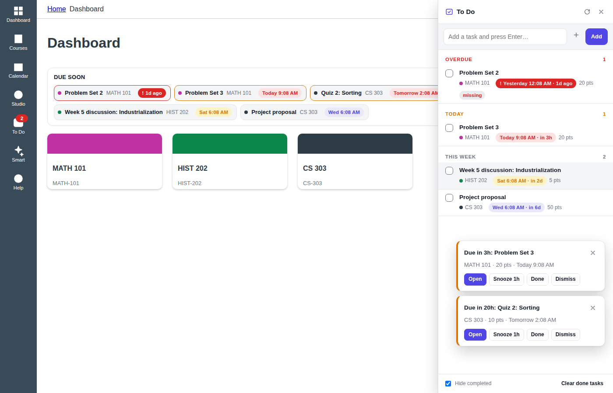
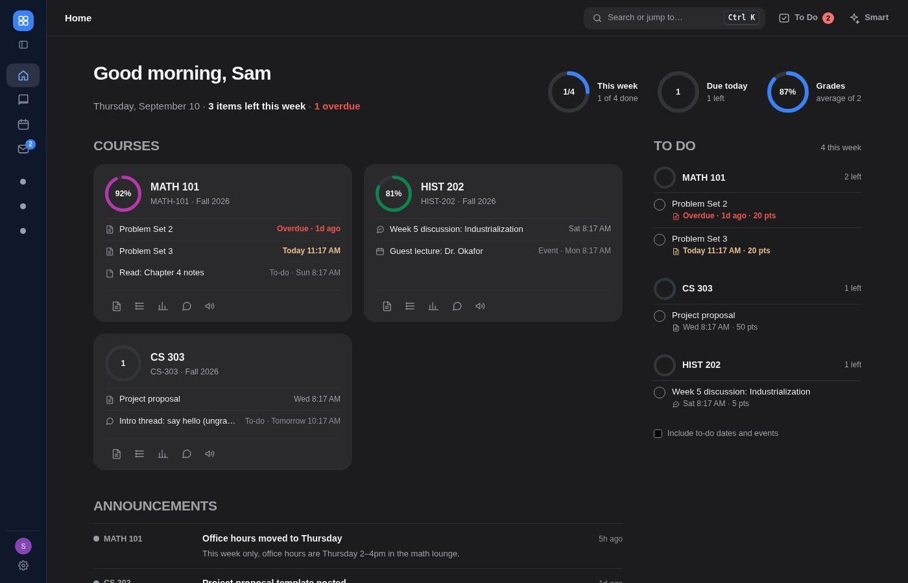
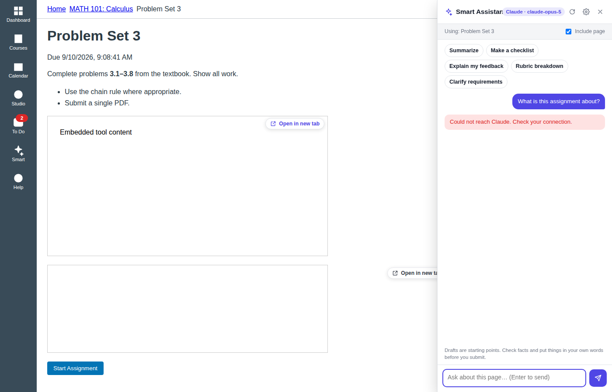

# BetterCourseViewer

A Mac app that installs a Safari extension to make **Canvas** cleaner, faster, and smarter.

- **Cleaner** – dark mode, themes (presets or your own colours), minimal mode, compact density, and switches to hide the dashboard sidebar, footer, card clutter, and nav items you never use.
- **Faster** – keyboard navigation (`g a` for assignments, `j`/`k` through lists, `1`–`9` for courses), a `⌘K` command palette that jumps to any course, section, or upcoming item, and an **Open in new tab** button on embedded assignments, tool launches, and file previews.
- **On top of things** – countdown badges next to everything with a due date, a "Due soon" strip on the dashboard, reminder pop-ups, a toolbar badge, and a **To Do** panel that combines Canvas items (checking them off syncs back to Canvas) with your own tasks.
- **Smarter** – a **Smart Assistant** sidebar powered by your own Claude or ChatGPT key: ask questions about the current page, summarize readings and assignments, turn an assignment into a checklist, draft discussion replies, get plain-language explanations of grades and rubric feedback, extract key dates from a syllabus, or plan your week from the dashboard.

Everything runs in your browser. Canvas data comes from your own logged-in session, and page content is sent to Claude or ChatGPT only when you use a smart feature.

## Screenshots

| Dashboard with the "Due soon" strip and reminders | To Do panel |
| --- | --- |
|  |  |

| Dark mode + minimal mode + Midnight theme | Smart Assistant on an assignment |
| --- | --- |
|  |  |

(Taken against the bundled mock Canvas, so the course content is fake.)

## Requirements

- macOS 13 Ventura or later, Safari 16.4 or later
- Xcode 15 or later (free, from the Mac App Store) to build the Mac app
- Optional: a [Claude API key](https://console.anthropic.com/settings/keys) and/or a [ChatGPT API key](https://platform.openai.com/api-keys) for the smart features

## Install (build the Mac app)

Safari extensions are shipped inside a Mac app, so the app is built with Xcode. The script below uses Apple's own converter to generate the Xcode project from the `extension/` folder.

1. Clone the repo and open a Terminal in it.
2. Generate the Xcode project and open it:
   ```bash
   ./scripts/build-mac-app.sh --open
   ```
3. In Xcode press **⌘R** (Product → Run). The BetterCourseViewer app opens and tells you the extension is ready.
4. In Safari go to **Settings → Extensions**, tick **BetterCourseViewer**, and click **Always Allow on Every Website** (or allow it on your school's Canvas site when Safari asks).
5. If you built without an Apple developer team, turn on **Safari → Settings → Developer → Allow unsigned extensions** (enable the Developer tab under Settings → Advanced if it is hidden).
6. Click the BetterCourseViewer toolbar icon → **Settings**, and paste your Claude and/or ChatGPT key. Press **Test** to check it.

To build from the command line instead of Xcode:

```bash
./scripts/build-mac-app.sh --build     # produces macos/build/BetterCourseViewer.app
```

The generated project references the files in `extension/` directly, so edits show up on the next build. Delete the `macos/` folder to regenerate the project from scratch.

### Build errors

- **"Embedded binary's bundle identifier is not prefixed with the parent app's bundle identifier"** – the two targets' identifiers drifted apart. In Xcode, select the project, then the **BetterCourseViewer** target → Signing & Capabilities and note its Bundle Identifier; then select the **BetterCourseViewer Extension** target and set its Bundle Identifier to that value plus `.Extension`. Give both targets the same Team, then Product → Clean Build Folder and run again. Regenerating with `rm -rf macos && ./scripts/build-mac-app.sh --open` also fixes it, since the script now normalises both identifiers.
- **"Failed to register bundle identifier"** (personal/free teams) – pick your own identifier: `BUNDLE_ID=com.yourname.bettercourseviewer ./scripts/build-mac-app.sh --open` (after deleting `macos/`).

### School with its own Canvas address?

The extension is on automatically for every `*.instructure.com` site. If your school uses a custom address such as `canvas.myschool.edu`:

1. Open that site in Safari.
2. Click the BetterCourseViewer toolbar icon → **Enable on canvas.myschool.edu**, or add it under **Settings → Canvas sites**.

## Using it

| Where | What you get |
| --- | --- |
| Canvas navigation | Two new items: **To Do** and **Smart**. Each opens a side panel. |
| Toolbar icon | Quick toggles for dark mode, theme, minimal mode, sidebar, reminders; buttons for To Do, Smart Assistant, the command palette and shortcuts. A red badge shows how many items are due soon. |
| Dashboard | A "Due soon" strip with colour-coded chips. Sidebar, footer and card clutter hidden by default (all optional). |
| Assignment, module and syllabus lists | Countdown badges (`Due in 3h`, `Overdue`, `Submitted`) next to every dated item. |
| Embedded content | An **Open in new tab** button on LTI tool launches, file previews and other embeds. |
| Smart Assistant | Quick actions that change with the page: *Summarize*, *Make a checklist*, *Explain my feedback*, *Rubric breakdown*, *Draft a reply*, *Reply to selected post*, *Practice questions*, *Key dates*, *Plan my week*, and free-form questions. Replies stream in; drafts can be copied or inserted straight into the discussion reply box. |

### Keyboard shortcuts

Press `?` on any Canvas page for the full list.

| Keys | Action |
| --- | --- |
| `⌘K` | Command palette: jump to any course, section, upcoming item or action |
| `g` then `d` / `c` / `i` / `k` | Dashboard / Courses / Inbox / Calendar |
| `g` then `h` / `a` / `m` / `g` | Course home / Assignments / Modules / Grades |
| `g` then `n` / `u` / `f` / `s` / `p` / `q` | Announcements / Discussions / Files / Syllabus / People / Quizzes |
| `1`–`9` | Open the nth course on your dashboard |
| `j` / `k`, then `o` or `↵` | Move through lists, open the focused item |
| `[` / `]` | Previous / next module item |
| `/` | Focus the page's search box |
| `t` / `s` | To Do / Smart Assistant |
| `⇧D` / `⇧M` | Toggle dark mode / minimal mode |
| `esc` | Close panels |

### Smart features and your keys

- Add one or both keys under **Settings → Smart features**. If both are set, the one you mark as preferred is used (Claude by default); otherwise whichever key exists is used.
- Default models are `claude-opus-5` and `gpt-5`; both are editable.
- **Response depth** trades speed and cost for more thorough answers.
- Keys are stored only in the extension's local storage on your Mac and are never included in settings exports.
- The Claude integration turns on Anthropic's server-side refusal fallbacks, so a request the safety classifier declines is retried on Anthropic's recommended substitute model automatically.

## Other browsers

The `extension/` folder is a standard Manifest V3 web extension and also loads in Chrome, Edge and Firefox:

- Chrome/Edge: `chrome://extensions` → Developer mode → **Load unpacked** → choose `extension/`.
- Firefox: `about:debugging` → **Load Temporary Add-on** → choose `extension/manifest.json`.
- `./scripts/package.sh` produces `dist/bettercourseviewer-<version>.zip` for distribution.

## Development

```
extension/
  manifest.json            Manifest V3 (Safari, Chrome, Firefox)
  background.js            streaming proxy to Claude/ChatGPT, key tests, badge, custom sites
  lib/                     settings, providers (raw fetch + SSE), Canvas REST helper,
                           page/route detection + context extraction, markdown, colour math
  content/early.js         document_start: applies dark/theme classes before first paint
  content/ui.js            toasts, side panels, nav items
  content/features/        theme, declutter, due-dates, todo, keyboard, embeds, smart-sidebar
  content/styles/          ui.css, dark.css, clean.css, duedates.css
  popup/, options/         toolbar popup and the settings page
scripts/
  build-mac-app.sh         generates the Xcode project / builds the .app
  package.sh               zips the extension
  make-icons.mjs           regenerates the PNG icons from the inline SVG
  dev/mock-canvas.mjs      a tiny fake Canvas (pages + API) for local testing
  dev/smoke-test.mjs       loads the extension in headless Chromium against the mock
```

Run the mock Canvas and the smoke test (needs Node 18+ and Playwright's Chromium):

```bash
node scripts/dev/mock-canvas.mjs        # http://localhost:8787
node scripts/dev/smoke-test.mjs         # screenshots in scripts/dev/out/
```

## Privacy

- No analytics, no accounts, no servers of its own.
- Canvas requests go to your Canvas site with your existing session cookie.
- Smart requests go directly from your browser to `api.anthropic.com` or `api.openai.com` with your key, and only include the page content the sidebar shows as "Using: …" (you can turn "Include page" off per chat).

## License

MIT
